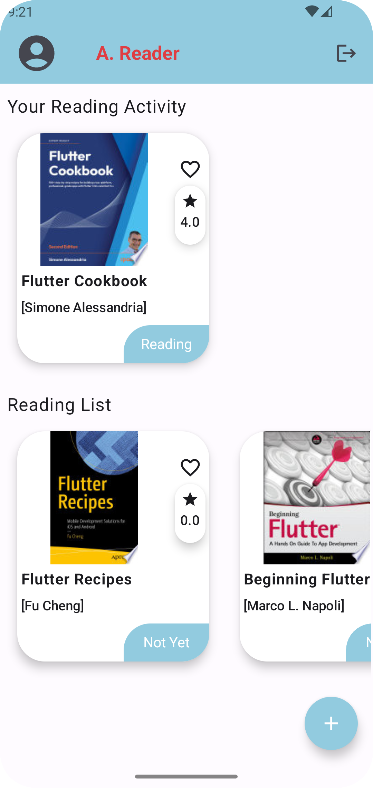
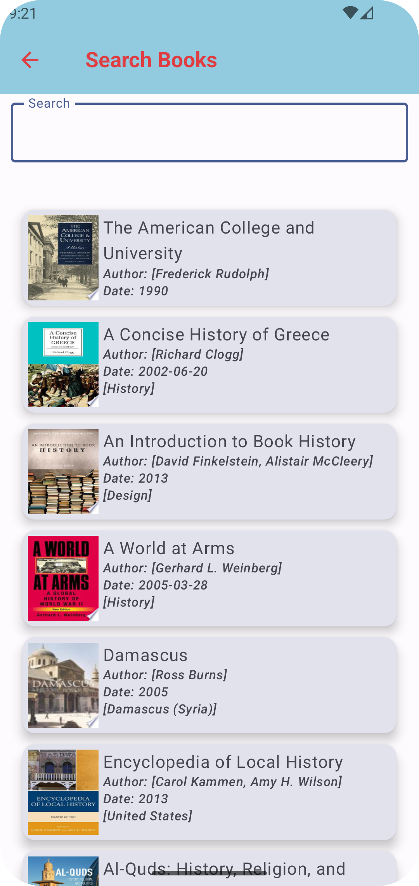
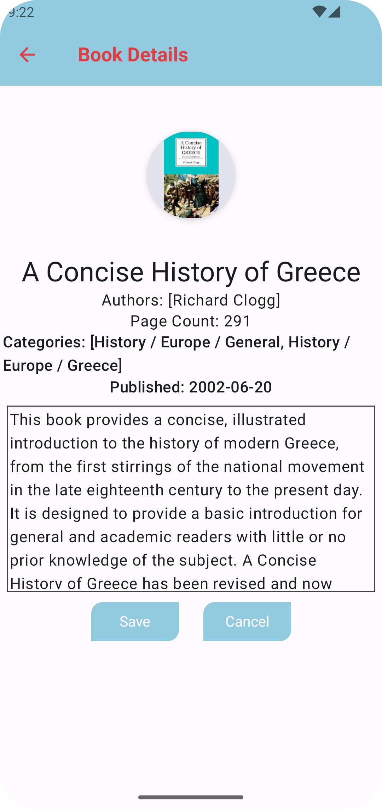
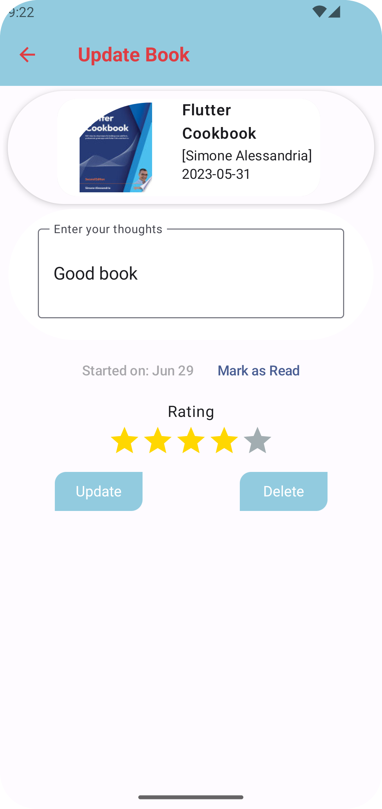
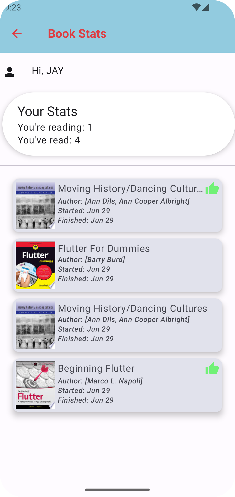
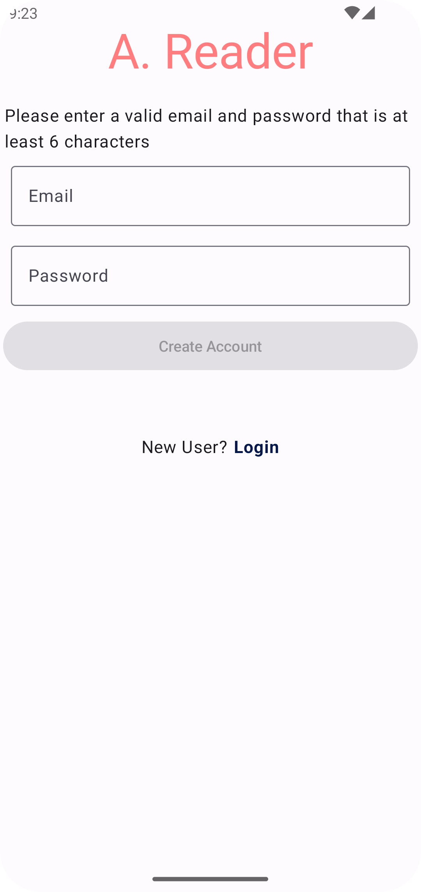
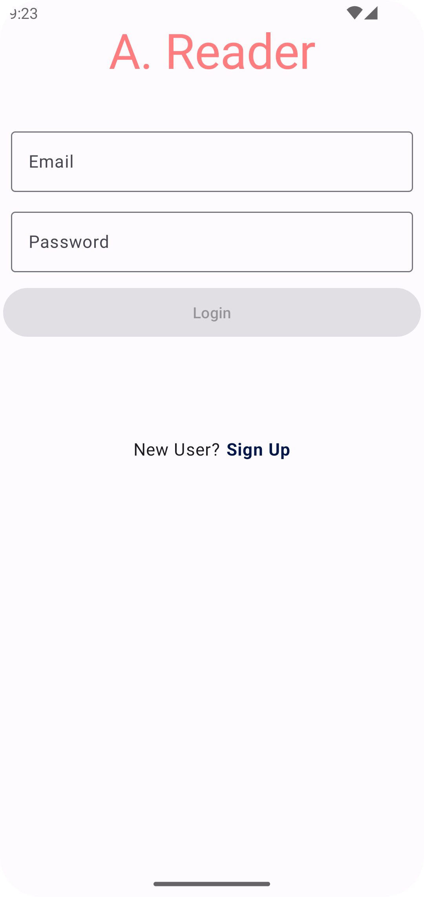

# JetReader
JetPack Compose Book Reader App

This app is a comprehensive book management tool allowing users to log in, search for books via the Google Books API, and add them to their personal library. Users can manage their library by marking books as currently reading, adding notes and ratings, and marking books as read. The app includes features like searching specific titles and also have a stats section where the user can see the read and current reading books.

The backend integration with Firestore and Firebase handles user authentication and data storage. The app employs the following:
- Clean architecture
- MVVM
- Retrofit
- Hilt for Dependency Injection
- Coroutines for asynchronous operations

<table>
  <tr>
    <td align="center"></td>
    <td align="center"></td>
    <td align="center"></td>
  </tr>
  <tr>
    <td align="center"></td>
    <td align="center"></td>
    <td align="center"></td>
  </tr>
   <tr>
    <td align="center"></td>
  </tr>

</table>